# Java GUI Demos - SWT

## Configuring SWT for Java Projects on Eclipse

---

The Standard Widget Toolkit (SWT) is a library that allows you to incorporate basic GUI elements and widgets into your programs.  Once you configure your IDE with the SWT files, you can incorporate these widgets into your programs.

---

**1**. Go to [https://download.eclipse.org/eclipse/downloads/](https://download.eclipse.org/eclipse/downloads/) and navigate to the **Latest Release heading**.  You’ll see a column titled **Build Name**.  Click on the build number that corresponds to the version of Eclipse you downloaded for class.  It will likely be version 4.14 (or higher), but if you’re unsure, just open Eclipse and click on the “About Eclipse” tab in the top menu bar.  

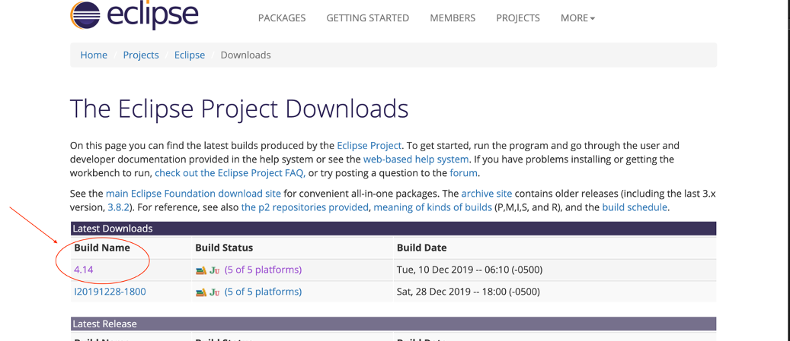

**2**.  After clicking on the build number, you’ll be taken to the downloads page.  Scroll down toward the bottom of the page, where you’ll find a heading called **SWT Binary and Source**.  There, you will select the appropriate download link for the operating system you’re using (Windows/Mac/Linux).

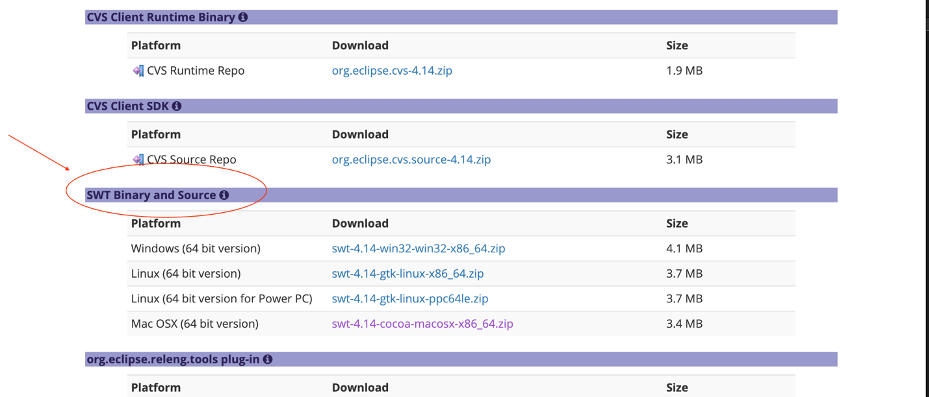

**3**.  Once the zip file is downloaded, ***don’t unzip the file***.  Just take note of where it was downloaded on your computer (Desktop, Downloads folder, etc.).

**4**.  Now that the SWT files are downloaded, we can add them to a project/workspace.  We’ll create a small project just to see a simple example of SWT widgets being used.  Go back to Eclipse and create a new project: `File -> New -> Java Project`.  You can name it whatever you’d like.  I called this example `GUIDemo`.  *Leave everything else at default and click Finish.  Note: you don’t need to create module-info.java for this example.  When prompted, just press the ‘don’t create’ button*. 

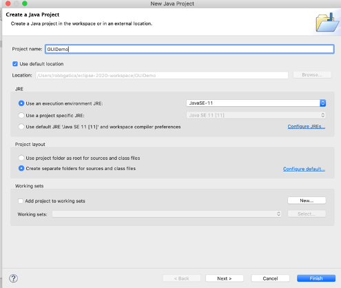

**5**.  Inside Eclipse, go to `File -> Import`.  The Import dialog screen will open, and from there you will select Existing **Projects into Workspace** and press the `Next` button.

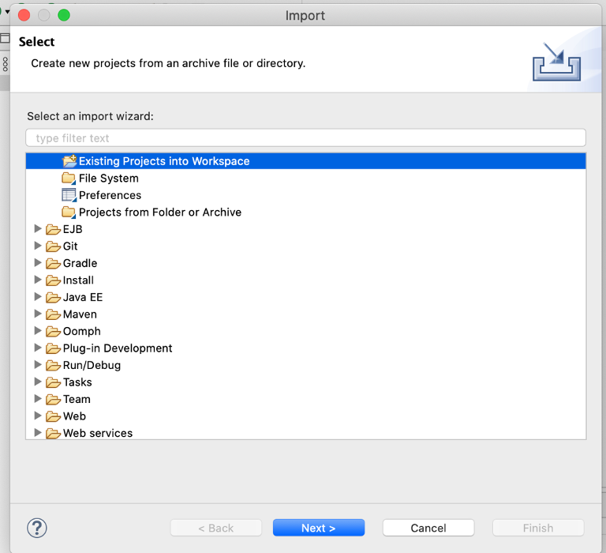

**6**.  Now you’ll see the **Import Projects** screen.  Choose the **Select Archive File** option and browse to the zip file you downloaded earlier.  You should now see a project called `org.eclipse.swt appear` in the Projects list.  Make sure the box next to org.eclipse.swt is checked (as shown below) and click `Finish`.  

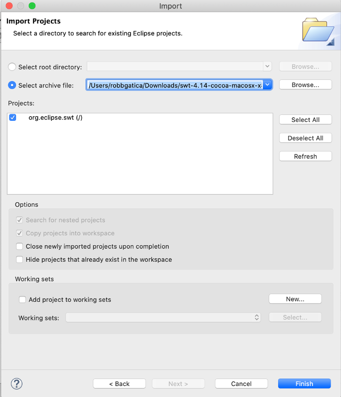

**7**.  At this point, the SWT project files are loaded into your workspace.  Now we can add them to the build path of our newly created `GUIDemo` project.   Select or highlight the GUIDemo project in the Package Explorer (the column on the left side of your screen) to make sure we are inside our project.  Go to `Project -> Properties` and select **Java Build Path** on the left column and then select the **Projects** tab (shown below).  Highlight **Classpath** and click `Add`.

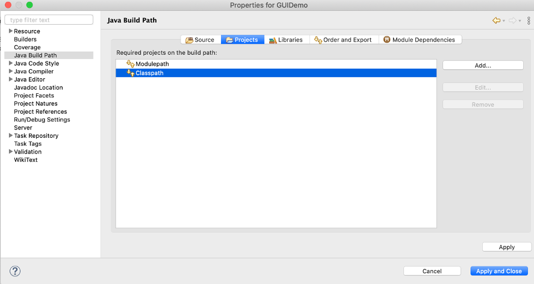

**8**.  The `org.eclipse.swt` project will appear in the **Required Project Selection** box.  Select this project by checking the box and press OK.  You can ignore the other projects in the figure below, they just happen to be in my current workspace.

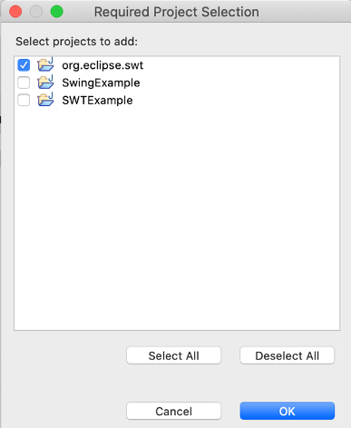

**9**.  You will now be returned to the **Projects** tab of the **Java Build Path** dialog.  The `org.eclipse.swt` project should be shown in the box titled ‘Required projects on the build path’.  Our newly created project – GUIDemo – now has access to all the SWT packages and source code.  Press **Apply and Close**. 

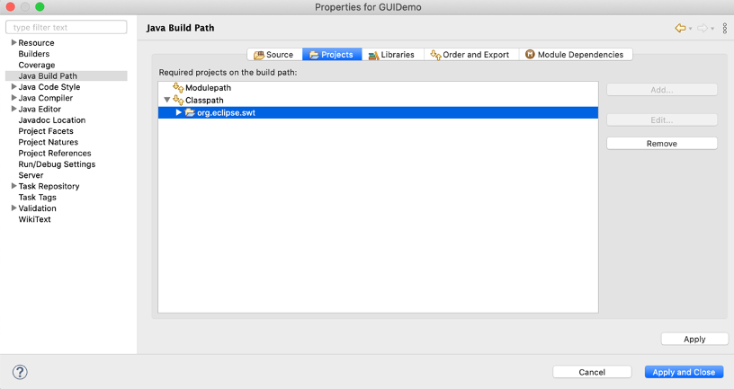

## Example 1 - Hello World

We can now try out some sample code to get a feel for how SWT works.  Go back to the GUIDemo project and create a new class.  You can name it whatever you’d like (‘Hello’ is the name in my example).  We’ll be creating a simple window that displays the text ‘Hello World!’, as shown below:

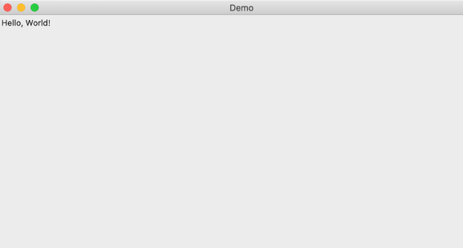

Go to the source code file [here](https://github.com/robbgatica/comp170-GUI/blob/master/src/com/swt/comp170/Hello.java).  Copy the code into your program and run it.  You should see a window pop up with the text inside.  Experiment with it.  Change the text inside the window, set different size parameters for the frame, etc.  

## Example 2 - Button Demo

This is another simple example that demonstrates button functionality and the processing of user input:

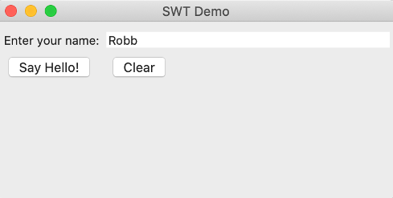
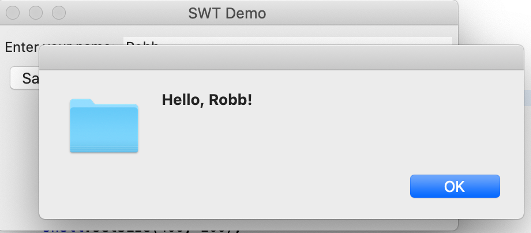

[Click here](https://github.com/robbgatica/comp170-GUI/blob/master/src/com/swt/comp170/ButtonDemo.java) to go to the source code.  Tinker with the code to get a feel for how the components interact... and definitely refer to the resources and documentation below!

### Additional Reading
**SWT Tutoria**l: [https://www.vogella.com/tutorials/SWT/article.html](https://www.vogella.com/tutorials/SWT/article.html)  
**Example Code Snippets**: [https://www.eclipse.org/swt/snippets/](https://www.eclipse.org/swt/snippets/)  
**Documentation**: [https://www.eclipse.org/swt/docs.php](https://www.eclipse.org/swt/docs.php)   
